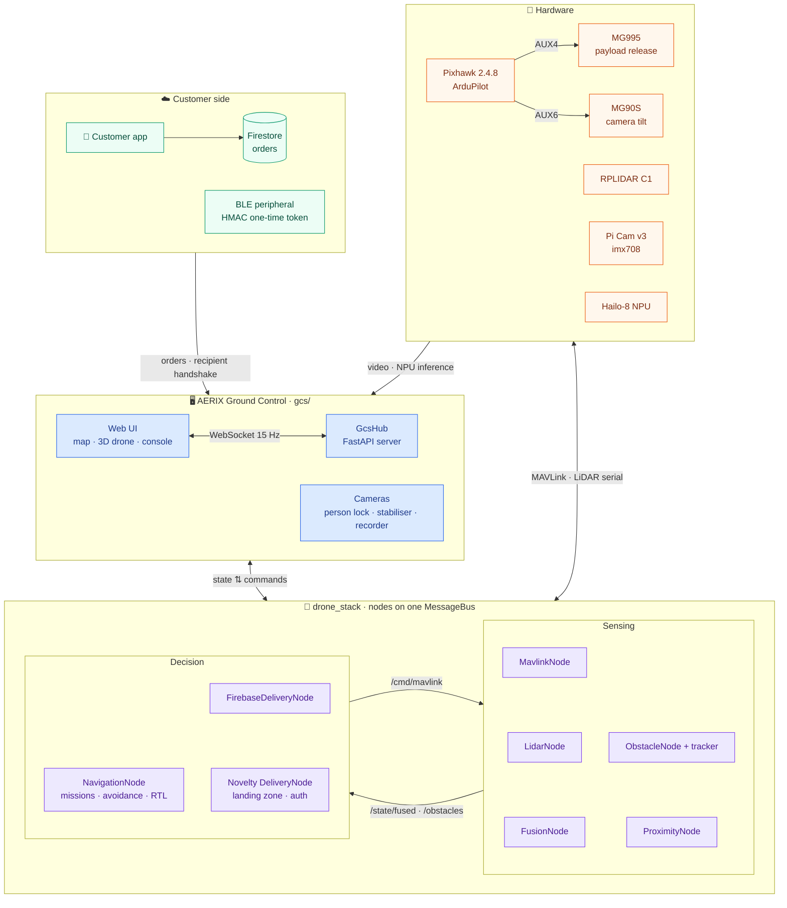
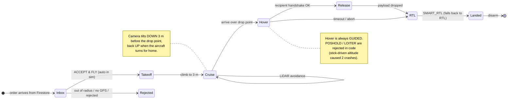
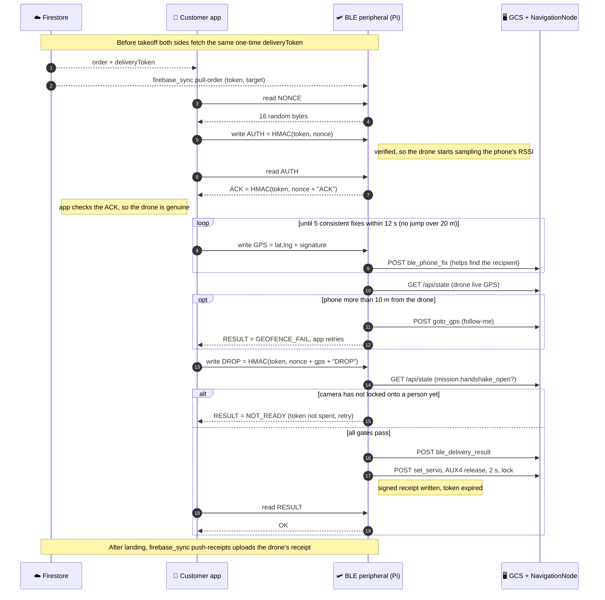
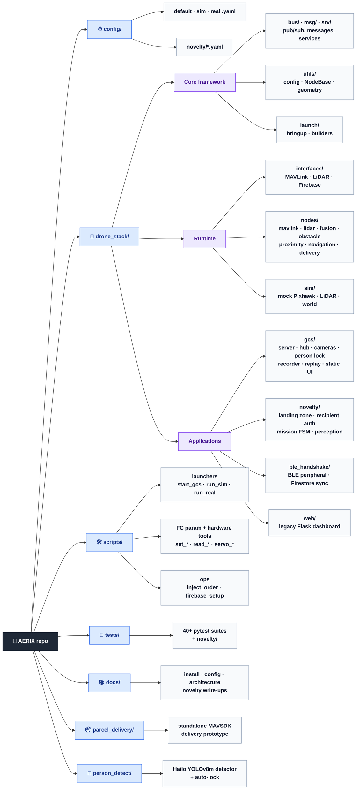

<div align="center">

# ✈️ AERIX

### Autonomous parcel-delivery drone — ground control, autonomy and perception on a Raspberry Pi 5

**Capstone Team 21**


A customer drops a pin in the phone app → the drone accepts the order, flies there
at a hard 3 m ceiling while avoiding obstacles with LiDAR, finds the recipient with
on-board AI, releases the parcel only after a BLE + vision handshake, and flies home.

[Features](#-features) ·
[Architecture](#-system-architecture) ·
[Protocols](#-communication-protocols) ·
[Repository map](#-repository-map) ·
[Quick start](#-quick-start) ·
[Configuration](#-configuration) ·
[Testing](#-testing) ·
[Safety](#-safety) ·
[Docs](#-documentation)

</div>

---

## ✨ Features

| | Area | What it does |
|:-:|---|---|
| 🛰️ | **Ground control (GCS)** | *AERIX GROUND CONTROL*: a single-page web app (FastAPI + WebSocket + Leaflet) streaming unified telemetry at 15 Hz, with a live 3D model of the drone that mirrors roll/pitch/yaw and prop speed. |
| 🧭 | **Autonomy** | Waypoint missions, a mission state machine, a hard **3 m altitude ceiling**, a home position latched once on the ground, SMART_RTL with a fallback to RTL, and pilot-override arbitration. |
| 🚧 | **Obstacle avoidance** | RPLIDAR C1 scans → obstacle extraction and tracking → VFH / sector / long-range avoidance on the Pi, plus `OBSTACLE_DISTANCE` streamed to the flight controller so avoidance still works when the pilot flies by hand. |
| 📦 | **Firebase delivery** | Orders from the Flutter app (Firestore) become flown missions: climb → cruise → GUIDED hover → release → SMART_RTL → land. An operator must press **ACCEPT** before it flies. |
| 🤖 | **On-board AI (Hailo-8)** | Aerial person detection on the NPU (a YOLO model trained on VisDrone), a flicker-free single-target person lock, digital stabilisation, and terrain-segmentation landing-zone scoring in the optional novelty layer. |
| 🎯 | **Camera-tilt servo** | An MG90S on AUX6 aims the Pi camera. It tilts **down** 3 m before the drop point so the operator sees the recipient from overhead, and back **up** for the flight home. |
| 🔐 | **Recipient handshake** | A BLE peripheral with an HMAC-signed one-time token. The MG995 payload servo (AUX4) releases only after the handshake passes. |
| 🎥 | **Flight recorder** | Starts recording when the drone arms and keeps one clip per flight. A post-flight replay renderer adds zero-phase stabilisation and a lock HUD, encoded to H.264. |
| 🧪 | **Simulation first** | Mock Pixhawk, LiDAR and world. The whole stack, including deliveries, runs with no hardware attached. |

> **Why no ROS?** ROS 2 Jazzy ships binaries only for Ubuntu 24.04, not Raspberry Pi OS
> (bookworm). This project rebuilds the parts of ROS it needs in plain Python that runs
> natively on the Pi: a named-topic **pub/sub bus**, typed **messages**, **services**,
> **launch** files and a **visualiser**.

---

## 🏗️ System architecture



Every arrow inside `drone_stack` is a topic on the in-process `MessageBus`. Nodes never call
each other directly. The topic-level version of this diagram is in
[docs/FILE_STRUCTURE.md](docs/FILE_STRUCTURE.md#2-runtime-data-flow).

**Command path, from UI to autopilot:** a button in the UI calls `send(cmd, params)` → `/ws` →
`GcsHub._dispatch` → a service call or a `NavCommand` on `/cmd/mavlink` → `MavlinkNode` →
pymavlink `command_long` / `set_position_target_*` → Pixhawk.

<details>
<summary><b>ROS concept → this project</b></summary>

| ROS | drone_stack |
|---|---|
| topic | `MessageBus` topic string (`drone_stack/bus/topics.py`) |
| message | `@dataclass` in `drone_stack/msg/` |
| service | `ServiceRegistry` in `drone_stack/srv/` |
| roslaunch | `drone_stack/launch/bringup.py` (driven by YAML) |
| rosparam | `config/*.yaml` (layered: default → sim / real) |
| RViz | the AERIX GCS web UI (`drone_stack/gcs/`) |

</details>

### Delivery flight profile



---

## 📡 Communication protocols

Every link in the system uses a standard transport. The one protocol designed for this project
is the **BLE delivery handshake** between the customer's phone and the drone.

| Link | Transport | Protocol | Code |
|---|---|---|---|
| Pi ⇄ Pixhawk | USB serial | MAVLink (ArduPilot common set, no custom dialect) | `interfaces/mavlink_interface.py` |
| Pi ← RPLIDAR C1 | USB serial, 460800 baud | Slamtec scan protocol, with a quality byte and persistence filter | `interfaces/lidar_interface.py` |
| Phone ⇄ Drone | Bluetooth LE GATT | **Custom AERIX handshake** (below) | `ble_handshake/drone_ble_peripheral.py` |
| Phone → Firestore ← Pi | HTTPS | Firestore orders; the drone writes separate `drone*` fields with `merge=True` | `interfaces/firebase_interface.py` |
| BLE peripheral → GCS | HTTP on localhost | `POST /api/command`, `GET /api/state` | `gcs/server.py` · `gcs/hub.py` |
| GCS ⇄ Browser | WebSocket `/ws` + MJPEG over HTTP | JSON state at 15 Hz with a credit window; adaptive-quality video | `gcs/ws_flow.py` · `gcs/cameras.py` |
| Node ⇄ Node | In-process | `MessageBus` pub/sub; state topics are latched, command topics never are | `bus/message_bus.py` |

### BLE delivery handshake

The drone advertises one GATT service with five characteristics. Every signature is
HMAC-SHA256, keyed with a **one-time `deliveryToken` for each order**, which the phone and the
drone both fetch from Firestore before takeoff.

| # | Characteristic | Access | Payload |
|:-:|---|:-:|---|
| 1 | `NONCE` `…5679` | read | 16 random bytes. Every read issues a new nonce and resets the session. |
| 2 | `AUTH` `…567a` | write | `HMAC(token, nonce)[:20]`, which proves the phone holds the token |
| 2 | `AUTH` `…567a` | read | `HMAC(token, nonce + "ACK")[:20]`, which proves the drone holds it too (mutual authentication) |
| 3 | `GPS` `…567c` | write | `"lat,lng"` (8 decimal places) + `0x00` + `HMAC(token, nonce + gps)[:16]` |
| 4 | `DROP` `…567b` | write | `HMAC(token, nonce + gps + "DROP")[:20]` |
| 5 | `RESULT` `…567d` | read | `OK` · `PENDING` · `NOT_READY` · `AUTH_FAIL` · `GEOFENCE_FAIL` · `SIGNATURE_FAIL` |



**The DROP gates, checked in order.** The first failure is what `RESULT` reports:

1. **Authenticated:** the `AUTH` HMAC matched the current nonce.
2. **Geofence:** 5 GPS fixes that agree with each other, and the phone within 10 m of the drone's own GPS.
3. **Signature:** the `DROP` HMAC binds the nonce and the verified GPS, so a DROP can't be replayed or moved to another position.
4. **Person locked:** the navigator opens the release window only when the camera has locked onto a person at the drop point. If the GCS doesn't answer, the release stays closed.

Other properties of the protocol:
- **The drone decides when the drop happened.** A successful write of `DROP` doesn't mean the parcel
  released. Only `RESULT = OK` does.
- **Each order's token works once.** After a drop, the token is spent and the drone writes a signed
  receipt. The drone's receipt and the phone's are uploaded separately, so there are two records.
- **Follows the current order.** The peripheral polls the GCS and reloads the token whenever a new order is being flown.
- **Fits the rest of the stack.** The peripheral never drives hardware directly. The servo channel and
  pulse widths come from `config/default.yaml` through the GCS.

> [!NOTE]
> **Hardening to do before a public demo:**
> - Replace the placeholder service UUID (`12345678-1234-5678-1234-567812345678`) with a randomly
>   generated one, in both the Pi code and the Flutter app.
> - Set `AERIX_BLE_STRICT=1` on the aircraft. This disables the `--dev` bench fallback, which
>   uses a token that is published in this repo.

### Other link-level rules

- **WebSocket flow control:** the browser acknowledges each telemetry frame after it has drawn it,
  and the server keeps at most 2 frames unacknowledged. Each frame also leaves out whatever that
  connection already has, so a slow tab gets fewer, always-fresh frames instead of a growing backlog.
- **Adaptive video:** the MJPEG stream steps down through 1.0 / 0.75 / 0.5 scale settings to suit the
  slowest viewer, and waits 25 s before trying a sharper one. The server socket sets
  `TCP_NOTSENT_LOWAT` so stale video can't queue up in the send buffer.
- **Command topics are never replayed:** `/cmd/mavlink`, `/mission/cmd` and the BLE events are
  event topics. A restarted node can't re-run an old `arm` or `takeoff`.
- **LiDAR goes to the autopilot too:** `ProximityNode` streams filtered 5° sectors as MAVLink
  `OBSTACLE_DISTANCE`, so ArduPilot's own avoidance still works while the pilot flies by hand.

---

## 🗺️ Repository map



A file-by-file version of this map, which also shows how the modules depend on each other, is in
**[docs/FILE_STRUCTURE.md](docs/FILE_STRUCTURE.md)**.

<details>
<summary><b>Plain-text tree</b></summary>

```
AERIX-Capestone-Team-21-/
├── config/                 YAML parameters, layered: default → sim | real
│   └── novelty/            per-module thresholds for the novelty layer
├── drone_stack/            the importable package
│   ├── bus/                MessageBus + canonical topic names
│   ├── msg/  srv/          typed dataclass messages, request/response services
│   ├── utils/              config loader, logging, geometry, NodeBase + Supervisor, NL parser
│   ├── launch/             bringup entrypoint + real/mock hardware builders
│   ├── interfaces/         MAVLink (pymavlink), RPLIDAR, Firebase — real + abstract
│   ├── nodes/              mavlink · lidar · fusion · obstacle(+tracker) · proximity
│   │                       navigation · firebase_delivery · phone_locator · diagnostics
│   ├── sim/                mock Pixhawk, mock LiDAR, kinematic SimWorld
│   ├── gcs/                AERIX GROUND CONTROL — FastAPI server, hub, cameras, Hailo,
│   │   └── static/         person lock, stabiliser, recorder, replay; web front-end
│   ├── novelty/            markerless landing, dual-factor recipient auth, mission FSM
│   │   └── perception/     model registry, Hailo adapters, pixel→ground projector
│   ├── ble_handshake/      BLE peripheral (HMAC token), Firestore sync, RSSI probe
│   └── web/                legacy Flask dashboard
├── scripts/                launchers, FC parameter tools, calibration + diagnostics
├── tests/                  pytest suites (unit, integration, sim) + novelty/
├── docs/                   install, configuration, architecture, novelty write-ups
├── parcel_delivery/        standalone MAVSDK + Firebase RTDB delivery prototype
└── person_detect/          Hailo-8 YOLOv8m aerial person detector + auto-lock
```

</details>

---

## 🚀 Quick start

### 1 · Simulation (no hardware needed)

```bash
git clone https://github.com/GVishwasReddy/AERIX-Capestone-Team-21-.git
cd AERIX-Capestone-Team-21-
python3 -m venv .venv && source .venv/bin/activate
pip install -r requirements-dev.txt && pip install -e .

# the full ground-control app, in sim
python -m drone_stack.gcs.server --config config/sim.yaml --port 8090
```

Open **http://localhost:8090**. You can arm, take off, fly missions and inject a test
delivery order with `scripts/inject_order.py --north 40`, all against the simulated drone.

<details>
<summary>Other entry points</summary>

| Command | What it runs |
|---|---|
| `scripts/run_gcs.sh [config]` | GCS in the foreground (port `8000`, or `$GCS_PORT`) |
| `scripts/start_gcs.sh sim\|real` | GCS detached on the Pi (port `8090`), logs to `logs/gcs.out` |
| `scripts/run_sim.sh` / `scripts/run_real.sh` | Headless stack + legacy Flask dashboard |
| `drone-gcs` / `drone-stack` | Console scripts installed by `pip install -e .` |

</details>

### 2 · Real hardware (Raspberry Pi 5)

```bash
pip install -r requirements-hardware.txt       # adds the RPLIDAR driver
scripts/start_gcs.sh real                      # → http://pi.local:8090
```

| Device | Port | Notes |
|---|---|---|
| Pixhawk 2.4.8 (ArduPilot) | `/dev/ttyACM0` | USB |
| Slamtec RPLIDAR C1 | `/dev/ttyUSB0` | 460800 baud |
| Raspberry Pi Camera v3 (imx708) | CSI | the only camera; MJPEG stream over the map, mounted upside down (rotated by the ISP) |
| Hailo-8 AI HAT+ | PCIe | the camera overlays fall back to plain video if missing |
| MG995 payload-release servo | Pixhawk **AUX4** (SERVO12) | separate supply, common GND · config block `payload:` |
| MG90S camera-tilt servo | Pixhawk **AUX6** (SERVO14) | separate 5 V supply, common GND · config block `aux2_servo:` |

On the Pi the GCS starts on boot as `aerix-gcs.service` (real mode, port 8090). **Only one
process may hold the Pixhawk port**, so stop the service before running `start_gcs.sh` or any
FC parameter script:

```bash
sudo systemctl stop aerix-gcs.service     # … run your script …
sudo systemctl start aerix-gcs.service
journalctl -u aerix-gcs.service -f        # live logs, including FC STATUSTEXT
```

### 3 · Firebase deliveries

```bash
scripts/firebase_setup.py <downloaded-service-account.json>   # validates + installs the key
```

The key is installed at `config/firebase-service-account.json`, which is **git-ignored and must
never be committed**. Without it the delivery panel reports `no-credentials`, and file-based or
injected orders still work.

---

## ⚙️ Configuration

Every tunable is set in YAML, and profiles are deep-merged on top of the defaults:

```
config/default.yaml   ← every parameter, with defaults (mode: sim)
   ├── config/sim.yaml   ← simulation overrides (auto-accept orders, no Firebase)
   └── config/real.yaml  ← hardware ports, 6S LiPo thresholds, operator ACCEPT required
config/novelty/*.yaml ← landing zone, recipient auth, motion monitor, FSM, models
```

Top-level sections: `mavlink` · `lidar` · `fusion` · `obstacles` · `navigation` · `proximity` ·
`safety` · `diagnostics` · `web` · `sim` · `payload` · `novelty` · `delivery` · `cameras` ·
`recording`. The environment variables `GCS_PORT`, `MAVLINK_PORT` and `LIDAR_PORT` override the
matching config values. See [docs/CONFIGURATION.md](docs/CONFIGURATION.md).

---

## 🧪 Testing

```bash
pytest                          # 876 passed, 1 skipped (libcamera is only available on the Pi)
pytest tests/novelty            # just the novelty layer
pytest parcel_delivery/tests    # the standalone prototype
```

The tests cover the bus, config, fusion, the obstacle pipeline, every avoidance strategy, RTL
and landing edge cases, transmitter authority, the delivery chain, the camera filter,
stabilisation and person lock, the recorder and replay, and WebSocket flow control. None of them
need hardware.

---

## 🛡️ Safety

> [!WARNING]
> This software flies a real aircraft. **Simulation is the default**, and real hardware runs only
> when you explicitly launch with `real`.

- **3 m ceiling is absolute.** Every commanded altitude goes through `NavigationNode._clamp_alt`.
- **Never hover in POSHOLD / LOITER / ALT_HOLD.** These modes take altitude from the throttle
  stick, and they caused two hard landings. The navigator rejects them in code and hovers in GUIDED.
- **The transmitter always wins.** When the pilot changes mode, the navigator stands down and
  stops commanding the aircraft.
- **Arm and Release Payload** both sit behind confirmation dialogs.
- **Before any real flight:** re-enable `ARMING_CHECK`, `FS_GCS_ENABLE` and
  `safety.failsafes_enabled` in `real.yaml`. They are relaxed for bench testing.

---

## 📚 Documentation

| Doc | Contents |
|---|---|
| [docs/FILE_STRUCTURE.md](docs/FILE_STRUCTURE.md) | File-by-file map and module dependency graph |
| [docs/diagrams/](docs/diagrams/) | High-resolution PNGs of every diagram, for slides and reports |
| [docs/ARCHITECTURE.md](docs/ARCHITECTURE.md) | Nodes, topics, threading and recovery model |
| [docs/INSTALL.md](docs/INSTALL.md) | Setting up the Pi from scratch |
| [docs/CONFIGURATION.md](docs/CONFIGURATION.md) | Config layering and key parameters |
| [docs/novelty/](docs/novelty/) | Landing zone, recipient auth, motion monitor, mission FSM |
| [docs/30auglidarintegration.md](docs/30auglidarintegration.md) · [docs/31aug_status.md](docs/31aug_status.md) | LiDAR integration log and project status |
| [parcel_delivery/README.md](parcel_delivery/README.md) | Standalone MAVSDK delivery prototype |
| [person_detect/README.md](person_detect/README.md) | Hailo-8 person detector |

---

<div align="center">

**AERIX** · Capstone Team 21 · MIT License

</div>
