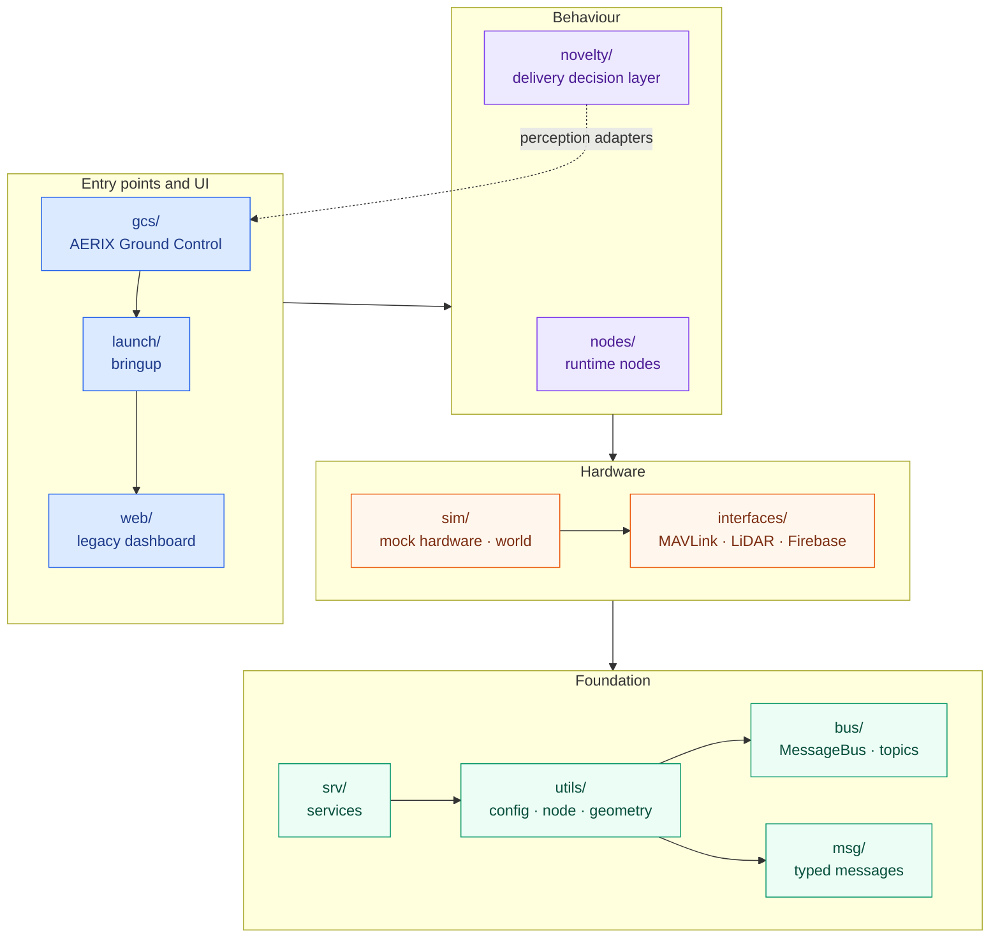
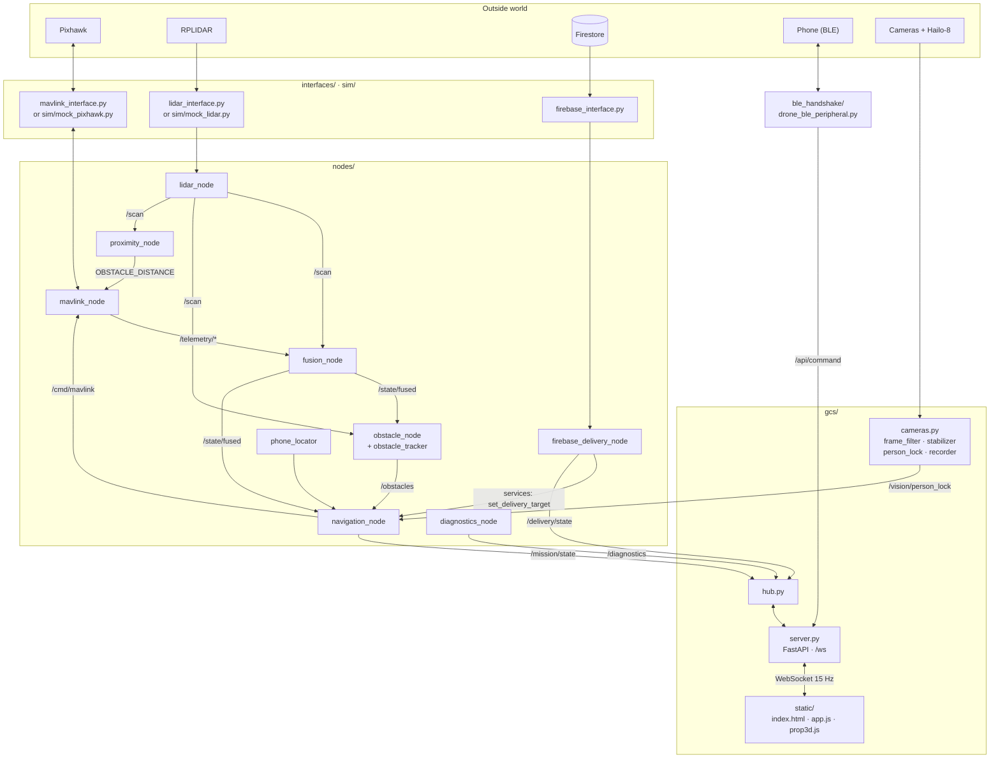

# 🗺️ File structure

A map of the repository at three zoom levels:

1. [**Package dependency graph**](#1-package-dependency-graph): which part of `drone_stack/` imports which.
2. [**Runtime data flow**](#2-runtime-data-flow): how the files talk to each other while the stack is running.
3. [**File-by-file reference**](#3-file-by-file-reference): every source file with a one-line description.

---

## 1. Package dependency graph

Arrows point from the importer to the package it imports. The edges come from the real `import`
statements in `drone_stack/`. The layers run bottom-up: the foundation packages know nothing
about the ones above them.

Each layer may import anything below it. Upper layers also import the foundation directly;
those edges are left out to keep the picture readable. The exact edges are in this table:

| Package | Imports from |
|---|---|
| `gcs/` | `launch` · `novelty` · `interfaces` · `bus` · `msg` · `srv` · `utils` |
| `launch/` | `nodes` · `novelty` · `sim` · `interfaces` · `web` · `bus` · `srv` · `utils` |
| `web/` | `bus` · `msg` · `srv` · `utils` |
| `nodes/` | `interfaces` · `bus` · `msg` · `srv` · `utils` |
| `novelty/` | `gcs` (perception adapters only) · `bus` · `msg` · `utils` |
| `sim/` | `interfaces` · `msg` · `utils` |
| `interfaces/` | `msg` · `utils` |
| `srv/` | `utils` |
| `utils/` | `bus` · `msg` |

> The one upward edge is `novelty → gcs`: `novelty/perception/adapters.py` wraps the Hailo
> runners in `gcs/hailo_infer.py`, and it is the only novelty module that touches hardware
> inference.

---

## 2. Runtime data flow

Here `gcs/server.py` calls `launch/bringup.build_supervisor()`, which starts every enabled node on a
shared `MessageBus`. Nodes never call each other directly. Everything goes through topics.

Topic names are defined in [`drone_stack/bus/topics.py`](../drone_stack/bus/topics.py). Topics
that carry commands (`/cmd/mavlink`, `/mission/cmd` and the BLE events) are **never latched**,
so a node that restarts can't replay an old `arm` or `takeoff`.

---

## 3. File-by-file reference

### Root

| File | Purpose |
|---|---|
| `README.md` | Project overview |
| `CLAUDE.md` | Detailed engineering notebook: hardware, incidents, changelog |
| `pyproject.toml` · `setup.py` · `setup.cfg` | Packaging; installs the `drone-stack` and `drone-gcs` console scripts |
| `requirements*.txt` | Core, hardware-only and dev dependencies |
| `firebase_sync.py` | Firestore store-and-forward utility (top-level copy) |

### `config/`

| File | Purpose |
|---|---|
| `default.yaml` | Every tunable with its default value (`mode: sim`) |
| `sim.yaml` | Simulation profile: file order source, auto-accept |
| `real.yaml` | Hardware profile: serial ports, battery thresholds, port 8090 |
| `novelty/landing_zone.yaml` | Surface, slope and clutter thresholds for markerless landing |
| `novelty/recipient_auth.yaml` | BLE and vision gating weights and margins |
| `novelty/motion_monitor.yaml` | Descent-abort velocity and zone-intrusion limits |
| `novelty/mission_fsm.yaml` | State timeouts |
| `novelty/models.yaml` | `.hef` model paths and class maps (fabseg has 8 channels) |

### `drone_stack/` core framework

| File | Purpose |
|---|---|
| `bus/message_bus.py` | Thread-safe, latched publish/subscribe bus |
| `bus/topics.py` | Canonical topic names and the set of event (non-latched) topics |
| `msg/messages.py` | Dataclass messages shared across the stack |
| `srv/services.py` | Small synchronous service registry |
| `utils/config.py` | Layered YAML config loading |
| `utils/node.py` | `NodeBase`, a self-healing threaded node, and `Supervisor` |
| `utils/geometry.py` | Coordinate and geodesy helpers |
| `utils/logging_setup.py` | Central logging configuration |
| `utils/nl_parser.py` | Natural-language command parser |
| `launch/bringup.py` | Single entry point: builds the bus and all enabled nodes |
| `launch/builders.py` | Chooses real or mock hardware from config |

### `drone_stack/` hardware and simulation

| File | Purpose |
|---|---|
| `interfaces/mavlink_interface.py` | Abstract MAVLink interface plus `RealMavlink` (pymavlink) |
| `interfaces/lidar_interface.py` | Abstract LiDAR interface plus the real RPLIDAR C1 driver |
| `interfaces/firebase_interface.py` | Order source: Firestore, file or none |
| `sim/world.py` | `SimWorld`, the kinematic drone and environment |
| `sim/mock_pixhawk.py` | Simulated Pixhawk |
| `sim/mock_lidar.py` | Simulated RPLIDAR (ray-casts the world) |

### `drone_stack/nodes/`

| File | Purpose |
|---|---|
| `mavlink_node.py` | Telemetry in, commands out |
| `lidar_node.py` | Publishes `LaserScan` and `PointCloud` |
| `fusion_node.py` | Complementary-filter state estimate, designed so an EKF can replace it |
| `obstacle_node.py` | Extracts and classifies obstacles from scans |
| `obstacle_tracker.py` | Tracks obstacles from one frame to the next |
| `proximity_node.py` | Streams filtered `OBSTACLE_DISTANCE` to the FC |
| `navigation_node.py` | Missions, avoidance, RTL, altitude ceiling, pilot override |
| `firebase_delivery_node.py` | Turns a customer order into a flown mission |
| `phone_locator.py` | Fuses BLE RSSI with the phone's own GPS |
| `diagnostics_node.py` | CPU, RAM, temperature, node and link health |

### `drone_stack/gcs/` AERIX Ground Control

| File | Purpose |
|---|---|
| `server.py` | FastAPI and WebSocket server |
| `hub.py` | `GcsHub`: owns the engine, builds the 15 Hz payload, dispatches UI commands |
| `ws_flow.py` | Flow control for each WebSocket connection |
| `cameras.py` | Camera capture, NPU overlays, MJPEG streaming |
| `hailo_infer.py` | Hailo-8 segmentation and detection runners |
| `frame_filter.py` | Real-time image conditioning |
| `stabilizer.py` | Live digital stabilisation for the Pi camera |
| `person_lock.py` | Single-target person lock (async NPU detector + Kalman filter) |
| `flight_state.py` | Decides when an armed aircraft has stopped flying |
| `recorder.py` | Flight video recorder that keeps one clip per flight |
| `replay_render.py` | Post-flight stabilised replay with HUD, encoded to H.264 |
| `static/index.html` · `app.js` · `style.css` | Single-page GCS front-end |
| `static/prop3d.js` · `models/` | Live 3D drone widget (three.js) |
| `static/fonts/` | Self-hosted web fonts |

### `drone_stack/novelty/` delivery decision layer (off by default)

| File | Purpose |
|---|---|
| `delivery_node.py` | The only novelty module connected to the bus |
| `landing_zone.py` | Markerless landing-zone scoring from segmentation |
| `recipient_auth.py` | Dual-factor BLE and vision release gate, plus choosing between several people |
| `motion_monitor.py` | Aborts the descent if the recipient moves or someone enters the zone |
| `mission_fsm.py` | Declarative state and transition table plus the engine |
| `evidence_logger.py` | Flight-log evidence records |
| `config.py` · `types.py` · `topics.py` | Validated config, value types and bus topics |
| `perception/model_registry.py` | Model interface abstraction |
| `perception/adapters.py` | Hailo model adapters |
| `perception/projector.py` | Projects pixels onto the ground plane (pinhole camera model) |

### `drone_stack/ble_handshake/`

| File | Purpose |
|---|---|
| `drone_ble_peripheral.py` | BLE GATT peripheral: HMAC token, GPS write, drop gating |
| `firebase_sync.py` | Pulls the active order and its one-time token from Firestore |
| `rssi_probe.py` | Reads the RSSI of a live BLE connection |
| `test_tp_link_bt.py` | Diagnostics for an external TP-Link BT dongle |

### `scripts/`

| Group | Files |
|---|---|
| **Launchers** | `start_gcs.sh`, `run_gcs.sh`, `run_sim.sh`, `run_real.sh`, `ble_handshake_start.sh` |
| **FC parameters: write** | `set_rc_aux.py`, `set_rtl_alt.py`, `set_pilot_descent_limit.py`, `set_avoidance_params.py`, `set_servo_travel.py`, `set_wp_yaw_behavior.py`, `set_mode_switch_ch9.py`, `clear_rc7_autotune.py`, `pidtune.py`, `pid_restore.py` |
| **FC parameters: read-only audits** | `read_safety_params.py`, `read_mode_params.py`, `read_rtl_land_params.py`, `aux_pin_check.py` |
| **Hardware diagnostics** | `servo_calibrate.py`, `servo_diagnose.py`, `rc_monitor.py`, `lidar_orientation_check.py`, `camera_latency.py`, `watch_mode_ws.py` |
| **Delivery and ops** | `inject_order.py`, `firebase_setup.py`, `dronectl.py`, `apply_camera_filter.py` |

### Side projects

| Path | Purpose |
|---|---|
| `parcel_delivery/` | Standalone prototype using MAVSDK and Firebase RTDB, with its own tests |
| `person_detect/` | Hailo-8 YOLOv8m (1280 px) aerial person detector and auto-lock node |

### `tests/` and `docs/`

`tests/` has more than 40 pytest suites plus `tests/novelty/`, and every one runs without hardware.
`docs/` holds the install, configuration and architecture guides, a write-up for each novelty module,
and dated integration logs.
