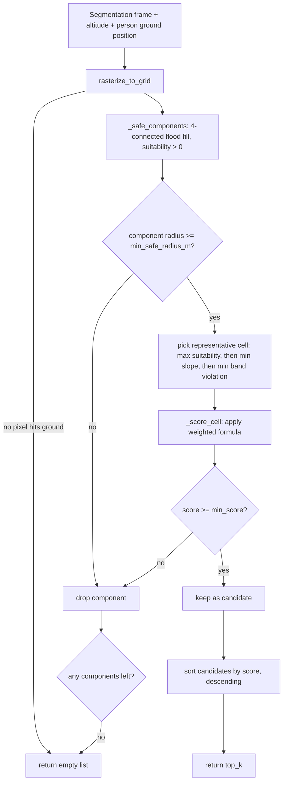

# §2.1 — Markerless landing-zone selection

Module: [`drone_stack/novelty/landing_zone.py`](../../drone_stack/novelty/landing_zone.py)
Config: [`config/novelty/landing_zone.yaml`](../../config/novelty/landing_zone.yaml)
Tests: [`tests/novelty/test_landing_zone.py`](../../tests/novelty/test_landing_zone.py)

## 1. Problem statement

AERIX must choose a touchdown point autonomously, with no physical marker
(no QR code, no ArUco tag, no beacon) placed by the recipient. The only
inputs available at decision time are:

- a per-pixel terrain **segmentation mask** from the onboard Hailo-8 model,
- the current **altitude** (from the fused EKF state),
- the recipient's **ground position** (from vision + BLE fusion, §2.2),
- camera intrinsics + mount pose, to project pixels to metres on the ground.

The zone must be physically safe to land on (walkable surface, no
obstruction, enough contiguous room for the airframe) *and* operationally
useful (close enough to the recipient to hand off the parcel, far enough to
not touch down on top of them). Both properties have to be scored, ranked,
and gated by a defined minimum before the mission FSM is allowed to
transition into `DESCENDING` — an ungated or undocumented "looks safe"
heuristic is not defensible as reduction-to-practice evidence.

## 2. Prior art

- **Amazon US10,198,955** ("Determining landing locations") — the closest
  prior art. It scores candidate landing locations from an onboard camera
  using pre-mapped/marked criteria and obstacle detection, with the
  suitability decision essentially binary (safe vs not) over a mapped area.
- **What this module does differently**: (a) suitability is a *continuous,
  weighted, per-class* score (`surface_suitability` per `TerrainClass`) over
  a live semantic segmentation, not a binary safe/unsafe map; (b) it fuses
  four independent terms — surface class, slope, clutter density, and
  contiguous safe-area size — into one auditable formula with named,
  config-driven weights, rather than a rule cascade; (c) it couples the
  scoring explicitly to a *live, moving* recipient position via a banded
  proximity penalty (`penalty_if_outside_radius`, §2.1 of the work order),
  so the "best" zone is defined relative to a person who may not be where
  they were when the map was last built — US10,198,955's approach assumes a
  largely static, pre-characterised landing area, not markerless, per-flight
  terrain semantics scored against a moving handoff target.
- Gaps in prior art this module fills: no dependency on a pre-built site map
  or fixed markers; the scoring formula's weights and thresholds are
  runtime-reconfigurable (YAML, §4 below) rather than baked into the model;
  the minimum-score gate is an explicit, testable contract
  (`min_score` → `[]` → the FSM's `SEARCHING_ZONE` state re-plans), not an
  implicit fallback.

## 3. Algorithm

```
score(cell) = w1 * surface_suitability(class)
            + w2 * (1 - normalized_slope)
            + w3 * (1 - clutter_density)
            + w4 * size_of_contiguous_safe_area
            - penalty_if_outside_radius(cell, person_centroid, r_min, r_max)
```

1. **Rasterize.** Project every pixel of the terrain segmentation frame to
   the ground plane (`GroundProjector.pixels_to_ground`, vectorised) and bin
   into a `cell_size_m` × `cell_size_m` grid (`rasterize_to_grid`). Each cell
   gets a plurality-vote terrain class and an obstacle-pixel count (clutter).
   Slope is `0°` with `slope_is_estimated=True` until a depth source exists
   — a documented low-confidence flat-earth fallback, not a silent
   approximation.
2. **Segment into safe components.** 4-connected flood fill over cells with
   `surface_suitability(class) > 0` (`_safe_components`). Cells with
   suitability `0` (water, obstacle) can never join a safe component, and a
   single-cell-thick unsafe boundary (e.g. an obstacle ring) fully isolates
   what it encloses — proven by `test_obstacle_ring_isolates_interior_as_separate_candidate`.
3. **Filter by footprint.** Components whose equivalent-circle radius
   (`sqrt(area_m2 / π)`) is below `min_safe_radius_m` are dropped before
   scoring — they cannot fit the airframe regardless of how good the terrain
   underneath is.
4. **Pick a representative cell and score it.** Within each surviving
   component, the representative cell is the one with the highest
   `surface_suitability`, tie-broken by lowest slope, tie-broken by the
   *smallest band violation* (`_band_violation` — see §3a below), then
   scored with the formula above (`_score_cell`).
5. **Gate and rank.** Drop candidates scoring below `min_score`, sort the
   rest descending, return the top `top_k`. An empty frame, no safe cells, or
   every candidate below threshold all correctly return `[]` — read by the
   mission FSM's `SEARCHING_ZONE` state as "not found yet", triggering
   `EXPANDING_SEARCH_RADIUS` rather than landing on the best-of-a-bad-set.

### 3a. The formula's four free terms, precisely defined

- `normalized_slope = min(slope_deg / max_slope_deg, 1.0)`
- `clutter_density = min(clutter_count / clutter_norm, 1.0)` — obstacle-class
  pixel count per cell (the brief's documented fallback signal, since no
  non-person-detection object channel exists yet).
- `size_of_contiguous_safe_area = radius_m / (radius_m + min_safe_radius_m)`
  — a smooth 0→1 saturating function of the component's equivalent-circle
  radius, **not** the raw metre value. This is a deliberate design
  correction: with `w1..w4` summing to `1.0` (as shipped in
  `landing_zone.yaml`) and the other three terms already bounded to `[0,1]`,
  an unbounded raw-metres area term would let an arbitrarily large blob's
  size alone push the score above `min_score` regardless of how unsuitable
  its surface or clutter is — defeating the point of a minimum-score gate.
  `min_safe_radius_m` is reused rather than inventing a second area-scale
  constant; the term is exactly `0.5` at that minimum viable footprint.
- `penalty_if_outside_radius(cell, person, r_min, r_max) = max(0, r_min - d, d - r_max)`
  where `d` is ground distance from the cell centre to the person. Zero
  inside the `[r_min, r_max]` band, growing linearly (in metres) outside it
  in either direction.

**Tie-break correctness.** The representative-cell tie-break minimises
`_band_violation`, not raw distance to the person. These disagree whenever
an entire safe component sits inside `r_min`: the *closer* a cell is to the
person there, the *larger* its penalty, so a raw-distance tie-break would
systematically pick the worst-penalised cell in exactly the case where the
choice matters. `test_representative_cell_minimises_band_violation_not_raw_distance`
locks this in.

### 3b. Flowchart



## 4. Config parameters (`config/novelty/landing_zone.yaml`)

| Key | Meaning | Shipped value | Status |
|---|---|---|---|
| `weights.w1_surface..w4_area` | Formula weights; sum to `1.0` so the area term's saturating `[0,1]` range stays comparable to `min_score`. | `0.40 / 0.25 / 0.20 / 0.15` | `# GUESSED` |
| `surface_suitability` | Per-`TerrainClass` score in `[0,1]`; `water`/`obstacle` are `0.0` (never joinable to a safe component). Every `TerrainClass` value must be present — enforced by `LandingZoneConfig`'s validator, fails loud otherwise. | grass .95, dirt .75, pavement .55, vegetation .30, water/obstacle 0, unknown .10 | `# GUESSED` |
| `r_min_m` / `r_max_m` | Acceptable distance band from the recipient; inside `r_min` risks landing on/too near them, outside `r_max` makes handoff impractical. | `2.0` / `12.0` | `# GUESSED` |
| `min_score` | Minimum acceptable total score; below it, `score_candidates` returns `[]` (triggers replanning). | `0.35` | `# GUESSED` |
| `max_slope_deg` | Slope at which `normalized_slope` saturates to `1.0` (full penalty). | `12.0` | `# GUESSED` |
| `min_safe_radius_m` | Smallest usable equivalent-circle footprint; also the area term's saturation scale (§3a). | `1.5` | `# GUESSED` |
| `top_k` | Max candidates returned. | `3` | — |
| `cell_size_m` | Grid cell edge length for rasterization. | `0.5` | — |
| `clutter_norm` | Obstacle-pixel count per cell at which `clutter_density` saturates to `1.0`. | `4.0` | `# GUESSED` |

All `# GUESSED` values need to be set from real flight/bench data before this
module's scores are meaningful — see the shipped YAML's own comments.

## 4a. Model interface (adapter contract)

`landing_zone.py` never talks to Hailo or a `.hef` directly - it only ever
consumes a `SegmentationFrame` (`class_indices: (h, w) int8` +
`index_to_class: dict[int, TerrainClass]`) from whatever `VisionModel` the
registry built for the `terrain` entry in `config/novelty/models.yaml`. Two
adapters can produce that same frame, selected by which field the model spec
sets - never by a `kind` flag, so a config typo that sets both is a
`ModelSpecConfig` validation error, not a silent pick of one:

| Model spec sets | Adapter used | Contract |
|---|---|---|
| `binary_fallback: {safe_class, unsafe_class}` + `seg_threshold` | `SegmenterAdapter` | Legacy sigmoid model, one logit channel. `sigmoid(logit) >= seg_threshold` -> boolean mask -> `{0: unsafe_class, 1: safe_class}`. |
| `class_map: [TerrainClass, ...]` | `MultiClassSegmenterAdapter` | Genuine N-class model, N output channels. Per-pixel `argmax` over channels (no threshold - argmax has none) -> `index_to_class = {i: class_map[i]}`. |

**Current shipped model:** `terrain` points at `models/fabseg.hef`
(delivered 2026-08-14), a real 7-class model whose channel order was
confirmed to match `TerrainClass`'s own declared enum order exactly (`grass,
pavement, dirt, water, vegetation, obstacle, unknown` = channels 0-6) - see
`config/novelty/models.yaml`'s `class_map`. This replaces the earlier binary
`terrain.hef` placeholder that this module was originally developed and
tested against (`_TopDownStub`-based tests in §6 below still use synthetic
`TerrainClass` grids directly and are unaffected either way - they test the
scoring formula, not the adapter).

`MultiClassSegmenter` (`drone_stack/gcs/hailo_infer.py`) picks whichever
output axis has size `num_classes` (NHWC vs NCHW) rather than assuming a
fixed layout, since the exact HailoRT tensor layout for `fabseg.hef` has not
yet been verified against real Hailo-8 hardware (no HailoRT tooling is
available on the Mac used for the initial implementation/tests) - see
"Known limitations" below.

## 5. Known limitations

- **Slope is always flat-assumed** (`slope_is_estimated=True`) — there is no
  depth source on the airframe yet. `normalized_slope` is therefore a
  documented low-confidence term, not a measured one, until a depth camera
  or stereo pair is added.
- **Clutter comes only from the segmentation's `obstacle` class**, not a
  dedicated small-object detector — the brief's documented fallback signal.
  A future non-person detection channel should feed `clutter_count` directly
  instead.
- **Camera intrinsics are uncalibrated placeholders** (`config/novelty/models.yaml`,
  `# GUESSED`) — every metre-scale value this module produces is only as
  accurate as that calibration.
- **`fabseg.hef` is untested on real Hailo-8 hardware as of 2026-08-14.**
  Development and the full test suite (this module + adapters + config) run
  on a Mac with no HailoRT installed, so every model wrapper degrades to
  `ok=False` and every test exercises the graceful-degradation path plus
  synthetic `TerrainClass` grids — never a real inference call. Two things
  specifically need first-boot verification on the Pi: (1) `class_map`'s
  channel order (confirmed with the model provider, not yet confirmed
  against the .hef's actual output tensor), and (2) `MultiClassSegmenter`'s
  NHWC-vs-NCHW axis detection (`drone_stack/gcs/hailo_infer.py`).
- **Roll about the optical axis is assumed 0** in the projector (image "up"
  aligned with the airframe's forward axis) — see
  `drone_stack/novelty/perception/projector.py`'s module docstring.

## 6. Test evidence

| Claim | Test |
|---|---|
| Formula terms bounded/composed correctly on a uniform safe surface | `test_all_grass_yields_one_full_candidate` |
| Unsafe terrain (water) correctly splits connectivity, never enters a candidate | `test_water_patch_splits_grass_into_two_disjoint_candidates` |
| A single-cell-thick unsafe boundary isolates its interior as its own candidate | `test_obstacle_ring_isolates_interior_as_separate_candidate` |
| Footprint gate rejects components under `min_safe_radius_m` before scoring | `test_safe_area_too_small_is_filtered_before_scoring` |
| `min_score` gate returns `[]` even for otherwise-ideal terrain | `test_everything_below_threshold_returns_empty_list` |
| No ground intersection (e.g. `altitude_m <= 0`) degrades to `[]`, not an error | `test_score_candidates_returns_empty_when_nothing_projects_to_ground` |
| Obstacle-pixel clutter is counted per cell independent of majority class | `test_rasterize_to_grid_counts_obstacle_pixels_as_clutter` |
| Clutter monotonically lowers score and saturates at `clutter_norm` | `test_score_cell_penalises_clutter_and_clamps_at_clutter_norm` |
| Representative-cell tie-break minimises penalty, not raw distance | `test_representative_cell_minimises_band_violation_not_raw_distance` |
| `penalty_if_outside_radius` is exactly zero inside `[r_min, r_max]`, linear outside | `test_band_violation` |
| Candidates are ranked by score and truncated to `top_k` | `test_score_candidates_ranks_by_score_and_respects_top_k` |
