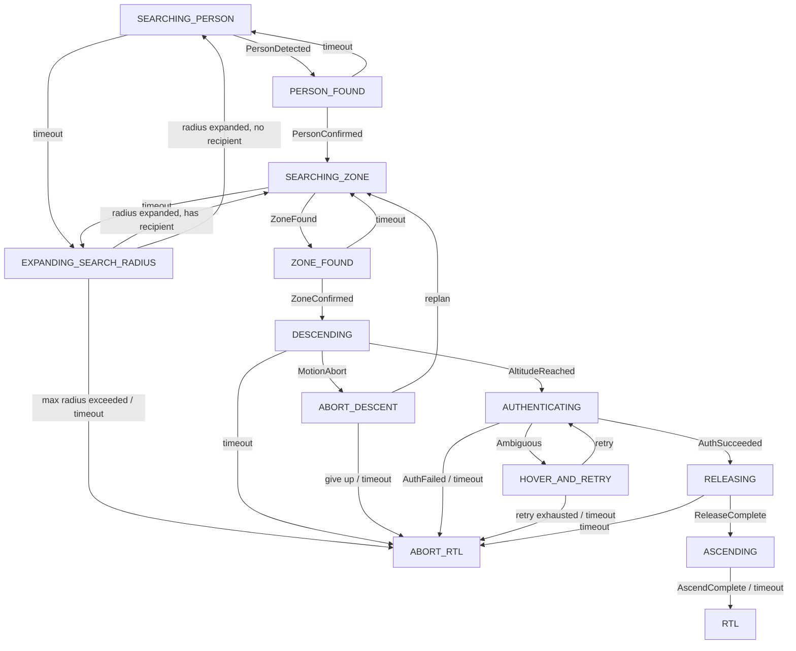

# §2.3 — Mission state machine + delivery orchestration

Modules: [`drone_stack/novelty/mission_fsm.py`](../../drone_stack/novelty/mission_fsm.py) (state/event/transition table + engine),
[`drone_stack/novelty/delivery_node.py`](../../drone_stack/novelty/delivery_node.py) (the bus-facing node that drives it)
Config: [`config/novelty/mission_fsm.yaml`](../../config/novelty/mission_fsm.yaml)
Tests: [`tests/novelty/test_mission_fsm.py`](../../tests/novelty/test_mission_fsm.py),
[`tests/novelty/test_delivery_node_integration.py`](../../tests/novelty/test_delivery_node_integration.py)

## 1. Problem statement

A single delivery attempt strings together four independent decisions —
where the recipient is (§2.5 disambiguation feeding into vision-only
tracking), where it is safe to land (§2.1), whether the correct recipient is
actually present at touchdown (§2.2), and whether descent is still safe as
it happens (§2.4) — plus recovery behaviour when any of them fails (retry,
widen the search, or abort). Implementing that as ad-hoc conditionals
scattered across a control loop is exactly the kind of undocumented,
untestable decision logic this whole novelty layer exists to replace with
something citable and independently verifiable. AERIX expresses the whole
attempt as one declarative table of states and transitions (patent Figure
material as-is — see the `TRANSITIONS` tuple in `mission_fsm.py`), walked by
a small generic engine, driven by a node (`DeliveryNode`) that turns each
transition into the same command surface every other part of this stack
already uses.

## 2. Prior art

Generic mission-planner/behaviour-tree autonomy stacks (PX4's own mission
mode, ROS `SMACH`/`BehaviorTree.CPP`) provide the state-machine *mechanism*
this module also uses, but none of them ship the *specific* delivery-attempt
table here — recipient disambiguation retried once via `HOVER_AND_RETRY`,
a descent abort that can itself decide to replan a new zone rather than
unconditionally aborting (`ABORT_DESCENT`'s replan/give-up branches), and a
search-radius-expansion ladder that only escalates to `ABORT_RTL` once a
configured ceiling is exceeded. A full prior-art citation search against the
drone-delivery patent landscape (in the style of `docs/novelty/
landing_zone.md`'s Amazon US10,198,955 citation for §2.1) has not yet been
completed for this module — this section should be filled in with the
specific closest prior art before this document is relied on as patent
evidence.

## 3. Algorithm

### 3a. The table is data; the engine is generic (`mission_fsm.py`)

`TRANSITIONS` is a tuple of `(from_state, event_type, to_state, guard,
description)` rows — reviewed and tested as pure data first (`validate_table()`,
called at import time: every endpoint is a real state, no terminal state has
an outgoing row, every non-terminal state has a `TimeoutEvent` row). `MissionFSM`
is a thin walker over that table:

- **`advance(event)`** — finds the current state's row whose `event_type`
  matches `type(event)` and whose `guard(ctx)` (if any) passes, and moves
  `self.state` to that row's `to_state`. No matching row is a no-op
  (`False`), not an error — a stray event that isn't valid from the current
  state is simply ignored.
- **`check_timeout(now)`** — if `now - state_entered_at >= state_timeout_s[state]`,
  synthesises a `TimeoutEvent` and calls `advance` with it. Every non-terminal
  state has exactly one `TimeoutEvent` row (enforced by `validate_table()`),
  so a state can never "hang" — every path eventually resolves.
- **Guards** (`has_confirmed_person`, `radius_below_max`, …) are small,
  named predicates over `ctx` (a plain mutable dict `delivery_node.py` owns)
  — this is how two rows sharing the same `(from_state, event_type)` stay
  data-driven instead of becoming an `if/else` embedded in the engine (e.g.
  `EXPANDING_SEARCH_RADIUS` routes back to `SEARCHING_ZONE` or
  `SEARCHING_PERSON` depending on whether a recipient is already confirmed).
- Every `advance` that fires a transition logs one record via
  `EvidenceLogger` (`event_name="fsm_transition"`, full event payload as
  `inputs`, the target state as `computed_values`, the *from*-state's
  configured timeout as `threshold`) — this is the patent-evidence trail for
  every state change, not just the terminal ones.

`RTL` and `ABORT_RTL` are terminal for *this* FSM: reaching either one hands
off to `NavigationNode`'s own `rtl` service (already-tested `RTL ->
COMPLETE` lifecycle) — the novelty layer does not duplicate flight-control
logic, per the project brief's own scope boundary.

### 3b. `DeliveryNode` — turning states into commands and events

`DeliveryNode` (a `NodeBase`, like every other node) owns one `MissionFSM`
plus the algorithmic modules it sequences (`landing_zone.score_candidates`,
`recipient_auth.DualFactorAuthenticator` / `disambiguate_recipients`,
`motion_monitor.MotionMonitor`) and a `GroundProjector`. Each `step()`:

1. Ground-projects any not-yet-projected `PersonDetection`s against the
   current altitude (see the module docstring's "Design note" on why this
   step lives here, not in the perception layer).
2. Feeds them to `MotionMonitor.update()` unconditionally, every step,
   regardless of FSM state — so track history is already primed by the time
   `DESCENDING` needs a velocity estimate.
3. Looks up a per-state handler (`_step_searching_person`, `_step_descending`,
   …) that inspects current sensor state and returns at most one `Event`, or
   `None`. An event is passed to `fsm.advance()`; no event falls through to
   `fsm.check_timeout()`.
4. If the state changed, runs the matching entry action
   (`_on_state_entered`) — this is where `NavCommand`s are actually
   published: `hold` + `goto` entering `DESCENDING`, `set_servo` entering
   `RELEASING`, `goto` (climb) entering `ASCENDING`, `rtl` entering
   `RTL`/`ABORT_RTL` — exactly mirroring `NavigationNode`'s own `_send`
   pattern (`Topics.MAVLINK_CMD` for direct autopilot commands,
   `Topics.MISSION_CMD` for `NavigationNode`'s registered services).
   `ABORT_DESCENT` and `EXPANDING_SEARCH_RADIUS` are transient — their entry
   actions immediately compute the next event themselves (no new sensor
   input needed) and call `fsm.advance()` again, which is why a caller can
   never observe the FSM "sitting in" either state (see Known limitations).
5. Publishes an `FsmStateSnapshot` on `NoveltyTopics.MISSION_FSM_STATE`.

Every `Event` `DeliveryNode` constructs — and every `check_timeout`/
`elapsed_in_state` call — is stamped with the SAME `self._now` for that
step (`step(now=...)`, defaulting to wall-clock time when omitted). This is
what lets the integration tests drive multi-minute timeout scenarios with a
synthetic clock instead of real `time.sleep`.

## 4. Config parameters (`config/novelty/mission_fsm.yaml`)

| Key | Meaning | Shipped value | Status |
|---|---|---|---|
| `state_timeout_s.<STATE>` | Per-state timeout before a `TimeoutEvent` fires. One entry required per non-terminal `MissionState` (fail-loud otherwise). | 5–60s per state | `# GUESSED` |
| `search_radius_expansion_m` | How much `EXPANDING_SEARCH_RADIUS` widens the search radius each time it fires. | `5.0` | `# GUESSED` |
| `max_search_radius_m` | Ceiling on the expanded radius before giving up (`MaxRadiusExceededEvent` → `ABORT_RTL`). | `30.0` | `# GUESSED` |
| `max_hover_retries` | Max times `HOVER_AND_RETRY` loops back to `AUTHENTICATING` before giving up. The brief specifies exactly one retry for disambiguation (§2.5). | `1` | per brief §2.5 |
| `descent_hover_altitude_m` | Altitude (`alt_rel_m`) above the chosen zone at which `DESCENDING` hands off to `AUTHENTICATING` — the hover height release happens at. | `2.0` | `# GUESSED` |
| `ascend_target_altitude_m` | Altitude at which `ASCENDING` hands off to `RTL` after a successful release. Validated `> descent_hover_altitude_m`. | `8.0` | `# GUESSED` |

All `# GUESSED` values need to be set from real flight/bench data before
this module's decisions are meaningful — see the shipped YAML's own
comments.

## 5. Known limitations

- **`ABORT_DESCENT` and `EXPANDING_SEARCH_RADIUS` are transient, not
  observable states.** Their entry actions resolve onward (replan/give-up;
  radius-expanded/max-exceeded) within the same `step()` call, per the
  TRANSITIONS table's own "evaluated immediately on entry" design (present
  since the Step-1 scaffolding). A caller can never see the FSM "parked" in
  either state — only that it passed through, which is why the integration
  tests for the two `ABORT_DESCENT` scenarios assert against the
  `EvidenceLogger`'s JSONL flight log rather than the live FSM state.
- **No `SERVO_OUTPUT_RAW` release confirmation yet.** `RELEASING` completes
  after a fixed `_RELEASE_SETTLE_S` (1.0s, a code constant, not a YAML
  threshold) rather than reading the servo's actual commanded-PWM readback
  off the bus — that telemetry isn't currently published on any `Topics`
  channel. A real confirmation replaces this once it is.
- **`DeliveryNode` assumes it is the only active "driver" once past
  `DESCENDING`.** It pulls `NavigationNode` out of its own waypoint mission
  with a `hold` service call before issuing its own `goto`/`set_servo`
  commands directly on `Topics.MAVLINK_CMD`, but there is no interlock
  preventing some OTHER command source from also publishing on that topic
  mid-attempt — acceptable for a single-operator bench/flight setup, not
  for a multi-controller deployment.
- **No prior-art citation yet** — see §2 above.

## 6. Test evidence

### Engine (`test_mission_fsm.py`)

| Claim | Test |
|---|---|
| Every declared transition is reachable via `advance()` given a guard-satisfying ctx | `test_every_declared_transition_is_reachable_via_advance` |
| A matching event transitions; a non-matching one is a no-op | `test_advance_on_matching_event_transitions`, `test_advance_on_non_matching_event_is_a_noop` |
| Terminal states reject every event | `test_terminal_states_reject_every_event` |
| Guard-based routing (`EXPANDING_SEARCH_RADIUS`) picks the correct branch | `test_expanding_search_radius_routes_to_zone_search_when_recipient_confirmed`, `test_expanding_search_radius_routes_to_person_search_when_no_recipient_yet` |
| `check_timeout` fires exactly at the configured window, not before, never on a terminal state | `test_check_timeout_fires_after_the_configured_window`, `test_check_timeout_does_not_fire_before_the_window_elapses`, `test_check_timeout_is_a_noop_on_terminal_states` |
| Every transition is logged; non-transitions are not | `test_advance_logs_a_transition_record`, `test_advance_does_not_log_when_no_transition_fires` |
| Full-table walkthroughs for the happy path and every abort branch | `test_happy_path_walkthrough_reaches_rtl`, `test_no_zone_found_eventually_aborts_via_radius_expansion`, `test_ble_or_vision_channel_failure_aborts`, `test_ambiguous_recipients_hover_then_abort_when_retries_exhausted`, `test_recipient_motion_or_intrusion_triggers_abort_descent`, `test_abort_descent_can_replan_back_to_zone_search_or_give_up` |

### `DeliveryNode` integration — the plan's seven scripted scenarios (`test_delivery_node_integration.py`)

| Scenario | Terminal state | Test |
|---|---|---|
| Happy path | `RELEASING → ASCENDING → RTL` | `test_happy_path_reaches_rtl` |
| No landing zone ever found | `ABORT_RTL` | `test_no_zone_found_aborts_to_rtl` |
| BLE channel never confirms | `ABORT_RTL` | `test_ble_channel_failure_aborts_to_rtl` |
| BLE/vision positions never agree | `ABORT_RTL` | `test_position_disagreement_aborts_to_rtl` |
| Ambiguous pair of candidates | `HOVER_AND_RETRY → ABORT_RTL` | `test_ambiguous_pair_hovers_then_aborts` |
| Recipient walks off during descent | `ABORT_DESCENT` (flight-log verified) `→ ABORT_RTL` | `test_recipient_motion_triggers_abort_descent` |
| Bystander enters the landing zone during descent | `ABORT_DESCENT` (flight-log verified) `→ ABORT_RTL` | `test_intruder_in_landing_zone_triggers_abort_descent` |
