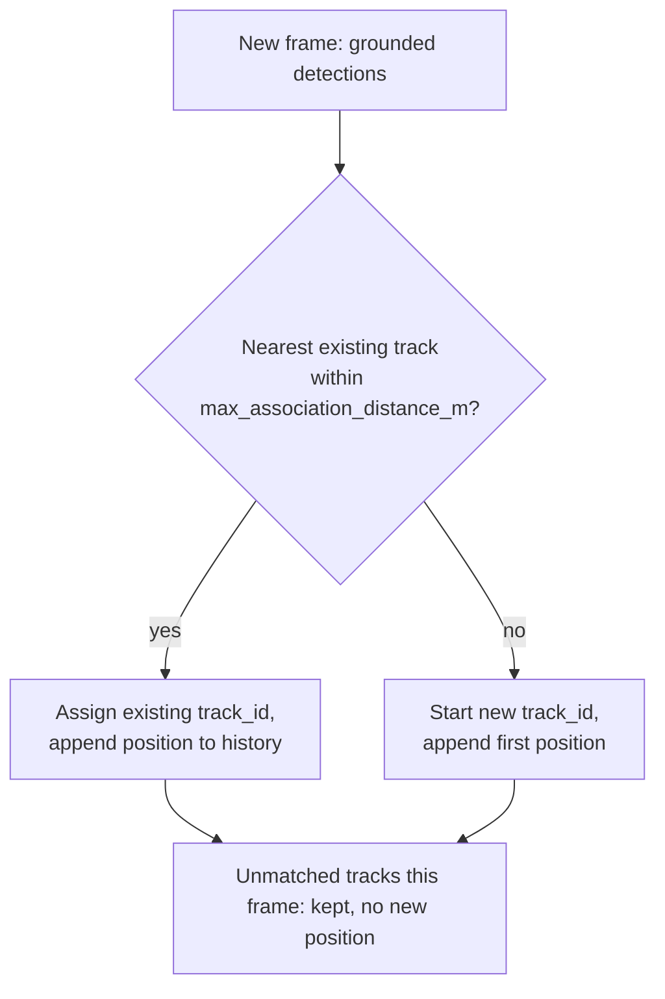
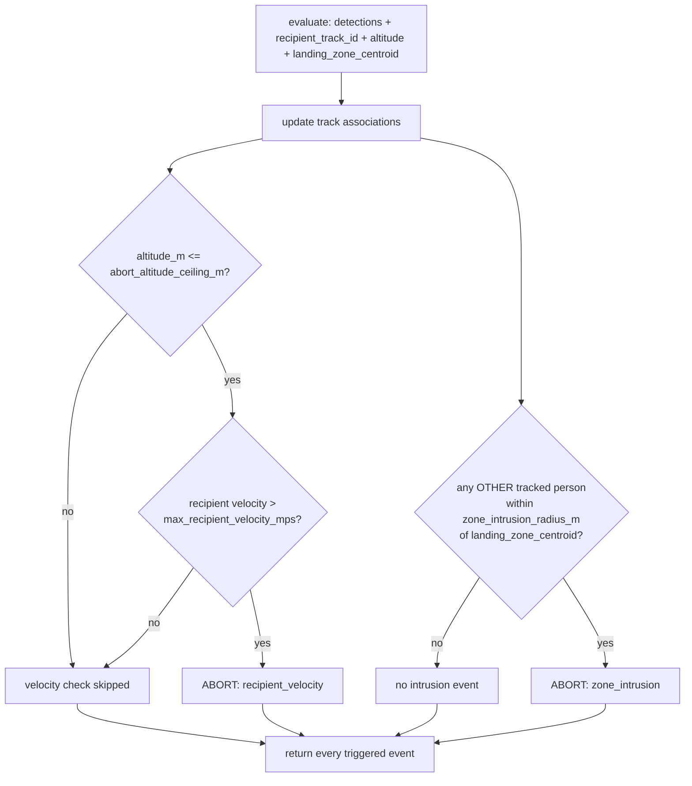

# §2.4 — Recipient-motion-aware descent abort

Module: [`drone_stack/novelty/motion_monitor.py`](../../drone_stack/novelty/motion_monitor.py)
Config: [`config/novelty/motion_monitor.yaml`](../../config/novelty/motion_monitor.yaml)
Tests: [`tests/novelty/test_motion_monitor.py`](../../tests/novelty/test_motion_monitor.py)

## 1. Problem statement

A landing zone that was safe at the moment of selection (§2.1) can stop being
safe during the descent itself: the confirmed recipient can walk out from
under the drone toward a hazard, or an unrelated bystander can wander into
the touchdown footprint after descent has already begun. A drone that only
re-checks terrain, not people, at the start of descent has no way to react to
either case. AERIX continuously tracks every visible person's ground motion
during descent and aborts if either the recipient's own motion or a third
party's presence makes the touchdown point unsafe — independent of, and in
addition to, the one-time terrain/authentication checks in §2.1 and §2.2.

## 2. Prior art

Static landing-zone hazard detection (verifying the ground is clear once,
before or at the start of descent) is the common baseline. AERIX improves on
this by treating the check as continuous through the whole descent and by
distinguishing two independently-hazardous motion patterns — the tracked
recipient moving briskly close to touchdown, versus a different, untracked
person entering the zone — rather than a single generic "is anyone too
close" test. A full prior-art citation search against the drone-delivery
patent landscape (in the style of `docs/novelty/landing_zone.md`'s Amazon
US10,198,955 citation for §2.1) has not yet been completed for this module —
this section should be filled in with the specific closest prior art before
this document is relied on as patent evidence, rather than asserting an
unverified citation here.

## 3. Algorithm

### 3a. Track association (`MotionMonitor.update`)

`MotionMonitor` owns `PersonDetection.track_id` assignment (per `types.py`'s
own docstring: "filled in by MotionMonitor's tracker"). Every call to
`update()`:

1. Drops any detection with no ground position — there is nothing to track.
2. For each remaining detection, finds the *nearest* existing track whose
   last known ground position is within `max_association_distance_m`, and
   assigns that detection to it (greedy nearest-match, one association per
   existing track per frame).
3. Any detection that matches no existing track within the gate starts a
   brand-new track.
4. A track with **no** matching detection this frame is kept, not dropped —
   one missed frame does not lose the recipient's identity — but produces no
   fresh position until it is matched again (see "Known limitations" below).

### 3b. Velocity estimation (`MotionMonitor.velocity_mps`)

"Simple average displacement over the window, not a single frame-to-frame
delta" (the shipped YAML's own comment): net displacement between the
**oldest** and **newest** position currently held for a track (up to
`track_history_len` frames, a bounded `deque`) divided by the elapsed time
between them. This smooths detector jitter that a raw last-two-frames delta
would amplify. Returns `None` until at least `min_track_frames` positions are
on record for that track, so a single noisy detection never drives a
decision.

### 3c. Two independent abort triggers (`evaluate`)

1. **velocity-above-threshold AND altitude-below-ceiling**
   (`check_velocity_abort`) — the tracked recipient's estimated speed exceeds
   `max_recipient_velocity_mps` **and** the drone's current altitude is at or
   below `abort_altitude_ceiling_m`. Both conditions are required, not
   either: a moving recipient high above touchdown still has time to be
   re-tracked before descent continues, so altitude gates the check (per
   `config/novelty/motion_monitor.yaml`'s own comment). Fires
   `MotionAbortEvent(reason="recipient_velocity")`.
2. **zone-intrusion** (`check_zone_intrusion`) — any tracked person **other**
   than `recipient_track_id` comes within `zone_intrusion_radius_m` of the
   landing-zone centroid, regardless of the recipient's own velocity or
   current altitude. An unrelated bystander wandering into the touchdown
   footprint is its own hazard, independent of the confirmed recipient's
   motion. Fires `MotionAbortEvent(reason="zone_intrusion")`.

`evaluate()` is the one-call-per-frame entry point: it runs `update()` then
both checks and returns every triggered event — zero, one, or both can fire
in the same frame (e.g. the recipient is both moving fast at low altitude
*and* a third party has entered the zone). The caller (`delivery_node.py`)
logs and acts on each event returned.

## 4. Config parameters (`config/novelty/motion_monitor.yaml`)

| Key | Meaning | Shipped value | Status |
|---|---|---|---|
| `max_recipient_velocity_mps` | Recipient ground speed above which (combined with low altitude) descent aborts. | `1.2` | `# GUESSED` — above normal shuffling/settling motion, well below a jog. |
| `abort_altitude_ceiling_m` | The velocity check only applies at or below this altitude. | `8.0` | `# GUESSED` |
| `zone_intrusion_radius_m` | Radius around the landing-zone centroid that must stay clear of non-recipient people during descent. | `3.0` | `# GUESSED` |
| `track_history_len` | Frames of position history kept per track for velocity smoothing (bounded deque). | `5` | `# GUESSED` |
| `min_track_frames` | Minimum frames of history required before a velocity estimate is trusted. Validated `1 <= min_track_frames <= track_history_len`. | `3` | `# GUESSED` |
| `max_association_distance_m` | Frame-to-frame tracking gate: a detection is matched to an existing track only within this ground distance of its last known position. | `2.0` | `# GUESSED` — loose enough to survive an occasional dropped frame without merging two different people; `recipient_auth.yaml`'s `r_min_m=2.0` suggests people are not expected closer together than that in a handoff scene. |

All `# GUESSED` values need to be set from real flight/bench data before this
module's decisions are meaningful — see the shipped YAML's own comments.

## 5. Known limitations

- **No track-eviction policy.** An unmatched track is kept indefinitely, not
  dropped after N missed frames — acceptable given this module's
  single-handoff-scoped usage (`reset()` is called between delivery
  attempts), but a long-running deployment tracking many transient people
  would accumulate stale tracks.
- **No depth/stereo sensing.** Ground position (and therefore velocity) comes
  entirely from the 2D ground projection (§2.1's `GroundProjector`), not a
  true 3D measurement — the same flat-earth/pinhole caveats documented in
  `docs/novelty/landing_zone.md` apply here.
- **Greedy nearest-neighbour association**, not a global optimum
  (e.g. no Hungarian algorithm) — for the small number of people expected in
  a single handoff scene this is an intentional simplicity/latency tradeoff,
  but it can mis-associate in dense-crowd scenes with many closely-spaced
  people.
- **No prior-art citation yet** — see §2 above.

## 6. Test evidence

| Claim | Test |
|---|---|
| Nearby successive detections join the same track | `test_update_assigns_same_track_id_to_nearby_successive_detections` |
| A detection beyond the association gate starts a new track | `test_update_starts_a_new_track_beyond_association_gate` |
| Two simultaneous people are tracked independently | `test_update_tracks_two_simultaneous_people_independently` |
| Detections without a ground position are left untracked | `test_update_ignores_detections_without_ground` |
| A missed frame does not lose the track | `test_missed_frame_does_not_lose_the_track` |
| No velocity estimate before `min_track_frames` | `test_velocity_mps_is_none_before_min_track_frames` |
| Velocity uses net displacement over the window, not last-frame delta | `test_velocity_mps_uses_net_displacement_over_window_not_last_delta` |
| Velocity window is bounded by `track_history_len` (old motion scrolls out) | `test_velocity_mps_window_is_bounded_by_track_history_len` |
| Unknown track_id returns `None` | `test_velocity_mps_unknown_track_is_none` |
| Fast + low altitude fires `recipient_velocity` | `test_velocity_abort_fires_when_fast_and_low` |
| Fast but above the altitude ceiling does not fire | `test_velocity_abort_does_not_fire_above_altitude_ceiling` |
| Slow (even if low) does not fire | `test_velocity_abort_does_not_fire_when_slow_even_if_low` |
| No abort decision before `min_track_frames` | `test_velocity_abort_none_before_min_track_frames` |
| A different person inside the radius fires `zone_intrusion` | `test_zone_intrusion_fires_for_a_different_person_inside_radius` |
| The recipient's own track never triggers intrusion | `test_zone_intrusion_ignores_the_recipients_own_track` |
| A person outside the radius does not fire | `test_zone_intrusion_ignores_a_person_outside_the_radius` |
| Ungrounded detections are ignored for intrusion | `test_zone_intrusion_ignores_detections_without_ground` |
| All-clear frame returns no events | `test_evaluate_returns_empty_list_when_all_clear` |
| Both events can fire together in one frame | `test_evaluate_can_return_both_events_in_one_frame` |
| `reset()` wipes history (not just the id counter) and restarts track ids | `test_reset_clears_all_track_history` |
