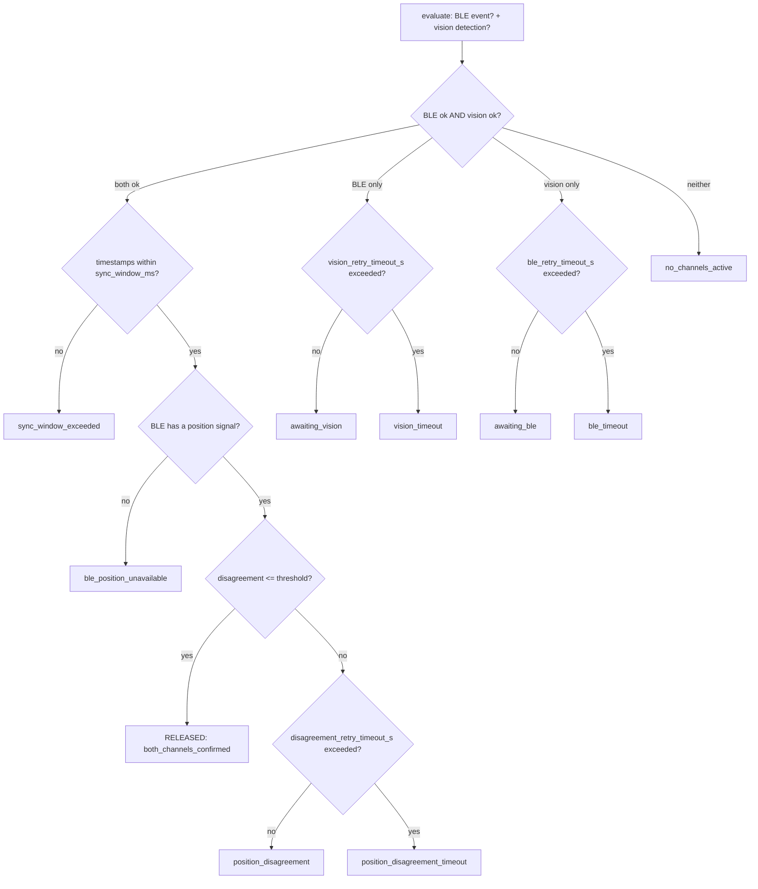

# §2.2 / §2.5 — Dual-factor recipient authentication + disambiguation

Module: [`drone_stack/novelty/recipient_auth.py`](../../drone_stack/novelty/recipient_auth.py)
Config: [`config/novelty/recipient_auth.yaml`](../../config/novelty/recipient_auth.yaml)
Tests: [`tests/novelty/test_recipient_auth.py`](../../tests/novelty/test_recipient_auth.py)

## 1. Problem statement

A delivery drone must not release its payload to the wrong person, or to no
one. A single authentication channel is a single point of failure: a BLE
handshake alone can be spoofed or can fire near the wrong person standing
nearby; a vision model alone cannot verify *identity*, only *presence*. AERIX
requires two independent, physically unrelated channels to agree before
release is authorized (`drone_stack/ble_handshake/drone_ble_peripheral.py`'s
BLE peripheral is **re-gated** to carry no release power of its own — see
§9's "BLE release path" decision — this module is the only path to
`released=True`). When more than one person is visible, the drone must also
pick the *correct* one before authenticating against them at all.

## 2. Prior art

BLE-proximity handshakes and delivery-confirmation phone apps are common in
last-mile delivery generally; single-factor "was a QR code/BLE beacon seen"
release logic is the typical baseline this module improves on by requiring
independent *agreement*, not just independent *presence*, between the two
channels — a spoofed or wrong-person BLE pairing that vision does not
corroborate at the same place and time does not release the parcel. A full
prior-art citation search against the drone-delivery patent landscape (in
the style of `docs/novelty/landing_zone.md`'s Amazon US10,198,955 citation
for §2.1) has not yet been completed for this module — this section should
be filled in with the specific closest prior art before this document is
relied on as patent evidence, rather than asserting an unverified citation
here.

## 3. Algorithm

### 3a. §2.2 — dual-factor fusion (`DualFactorAuthenticator`)

Two channels, six branches, all config-driven
(`config/novelty/recipient_auth.yaml`):



1. **both-ok** — BLE `authenticated=True` and a vision `PersonDetection` with
   a ground position are present in the same call, timestamps agree within
   `sync_window_ms`, and their independently-estimated ground positions
   agree within tolerance → `released=True`, `reason="both_channels_confirmed"`.
2. **A-only** — BLE ok, vision not yet → `awaiting_vision` until
   `vision_retry_timeout_s` elapses (per-channel clock starts the moment
   that channel *first* went ok; see §3c).
3. **B-only** — vision ok, BLE not yet → `awaiting_ble` until
   `ble_retry_timeout_s`.
4. **disagree** — both individually ok, positions disagree → `position_disagreement`,
   retried for up to `disagreement_retry_timeout_s` (transient GPS/RSSI noise
   should not immediately abort a otherwise-healthy handoff).
5. **timeout** — branch 2, 3, or 4's retry window is exceeded → a terminal,
   non-released decision (`vision_timeout` / `ble_timeout` /
   `position_disagreement_timeout`) that the mission FSM reads as "give up",
   not "keep waiting".
6. **sync-window miss** — both channels are individually ok and would even
   agree on position, but arrived more than `sync_window_ms` apart →
   `sync_window_exceeded`, not accepted as describing the same real-world
   moment.

Two further **defensive** cases the config schema permits but the six
brief-numbered branches don't name: `no_channels_active` (neither channel
ok) and `ble_position_unavailable` (BLE `authenticated=True` but neither
`rssi_dbm` nor `phone_gps` was reported — cannot check agreement, so this
never silently releases).

### 3b. §2.5 — multi-person disambiguation (`disambiguate_recipients`)

```
likelihood(person) = alpha_ble_position    * position_score(person)
                    + beta_rssi_consistency * rssi_consistency_score(person)
                    + gamma_motion_cue      * motion_cue_score(person)
```

- `position_score(person) = clamp(1 - dist_to_ble_gps_m / max_position_disagreement_m, 0, 1)`
  if the BLE event carries `phone_gps` (a full 2D fix), else `0.0` — no fix
  means no positional evidence either way, not a free pass for every
  candidate.
- `rssi_consistency_score(person) = clamp(1 - |range_diff_m| / max_position_disagreement_m_rssi_only, 0, 1)`
  if the BLE event carries `rssi_dbm` (range-only, no bearing — see §3c),
  else `0.0`.
- `motion_cue_score(person)` is a caller-supplied, per-`track_id` hook —
  `gamma_motion_cue` ships as `0.0` (§4 below), so it is a **documented
  no-op today**, not a missing feature silently doing nothing
  (`test_disambiguation_motion_cue_is_a_documented_noop_at_shipped_gamma`
  locks this in). §2.4's `motion_monitor.py` is the natural future source of
  a real "walking toward the drone" cue.

**Margin rule.** Candidates are ranked by `likelihood`; the top one is only
accepted as `DisambiguationResult.winner` if it beats the runner-up by at
least `disambiguation_margin`. Otherwise `winner=None` — the mission FSM's
`HOVER_AND_RETRY` state re-observes rather than committing to a guess
between two similarly-likely people. A single candidate is always
unambiguous by construction (no runner-up to be confused with).

### 3c. BLE position fusion (shared by both features above)

Locked design decision: BLE's own ground-position estimate is **fused**,
phone GPS when available, RSSI-only range as a fallback:

- **Phone GPS present** — converted to a body-relative `GroundPoint` via
  `drone_stack.utils.geometry.geodetic_to_enu` (ENU: x=East, y=North)
  followed by the ENU→body-frame (x=forward, y=left) rotation using
  `FusedState.yaw`. This yaw convention was **verified against
  `drone_stack/sim/world.py`**, not assumed: that file's body→ENU rotation
  (`vx = bvx*cos(yaw) - bvy*sin(yaw)`, `vy = bvx*sin(yaw) + bvy*cos(yaw)`)
  and its own comment ("our ENU yaw is CCW-positive") confirm yaw is a
  standard math angle measured CCW from ENU's +x (East) axis — **not**
  compass heading (0=North, CW-positive). `_phone_gps_ground_point` applies
  that rotation's inverse; `test_phone_gps_ground_point_yaw_90deg_forward_is_north`
  is the regression test for getting this backwards. This gives a full 2D
  position, comparable to vision's `GroundPoint` with the tighter
  `max_position_disagreement_m`.
- **RSSI only** — `drone_stack.novelty.config.RssiPathLoss`'s log-distance
  model, `d = 10 ** ((tx_power_dbm - rssi_dbm) / (10 * path_loss_exponent))`,
  gives a **scalar range only, no bearing** — so it can only be compared
  against vision's own range-from-drone, using the wider
  `max_position_disagreement_m_rssi_only` (RSSI ranging is coarse and worse
  with body blocking).

## 4. Config parameters (`config/novelty/recipient_auth.yaml`)

| Key | Meaning | Shipped value | Status |
|---|---|---|---|
| `sync_window_ms` | Max timestamp gap between a BLE and vision event to count as the same moment. | `2000` | `# GUESSED` |
| `max_position_disagreement_m` | Agreement tolerance when BLE has a phone GPS fix (full 2D position). | `4.0` | `# GUESSED` |
| `max_position_disagreement_m_rssi_only` | Wider agreement tolerance when BLE only has RSSI (range-only). Must be `>= max_position_disagreement_m` (`RecipientAuthConfig` validator enforces this — RSSI ranging is coarser than GPS). | `10.0` | `# GUESSED` |
| `vision_retry_timeout_s` | How long to wait in A-only (BLE ok, vision not) before `vision_timeout`. | `15.0` | `# GUESSED` |
| `ble_retry_timeout_s` | How long to wait in B-only (vision ok, BLE not) before `ble_timeout`. | `15.0` | `# GUESSED` |
| `disagreement_retry_timeout_s` | How long to tolerate a position disagreement before `position_disagreement_timeout`. | `10.0` | `# GUESSED` |
| `disambiguation_margin` | Minimum likelihood lead the top candidate needs over the runner-up to be accepted. | `0.15` | `# GUESSED` |
| `disambiguation_weights.alpha_ble_position` / `beta_rssi_consistency` / `gamma_motion_cue` | §3b formula weights. | `0.6 / 0.4 / 0.0` | `# GUESSED` (`gamma` deliberately `0.0` — no real motion-cue source exists yet) |
| `rssi.tx_power_dbm` / `rssi.path_loss_exponent` | Log-distance path-loss model parameters (§3c). | `-59.0 / 2.7` | `# GUESSED` |

All `# GUESSED` values need to be set from real flight/bench data before
this module's decisions are meaningful — see the shipped YAML's own
comments.

## 5. Known limitations

- **RSSI ranging is coarse** (±5–10 m, worse with body blocking) and
  direction-less — the fused estimator falls back to it only when no phone
  GPS is available, and widens its tolerance accordingly, but position
  agreement will be weak until the phone reliably reports GPS.
- **`gamma_motion_cue` is `0.0`** — disambiguation currently only ever uses
  BLE-position and RSSI-consistency evidence; a real motion cue (e.g. from
  §2.4's `motion_monitor.py`) is future work, not yet wired in.
- **The ENU→body-frame yaw rotation assumes `FusedState.yaw`'s convention
  matches `drone_stack/sim/world.py`'s** (CCW-positive from ENU +x/East). If
  the *real* fusion node (as opposed to the sim) ever reports yaw in a
  different convention, `_phone_gps_ground_point` needs the corresponding
  fix — this has been verified against the sim's kinematic model, not
  against real Pixhawk/MAVLink attitude output.
- **No prior-art citation yet** — see §2 above.

## 6. Test evidence

| Claim | Test |
|---|---|
| Both channels ok + agreeing positions releases | `test_both_ok_and_positions_agree_releases` |
| A-only waits, then times out | `test_a_only_awaits_vision_then_times_out` |
| B-only waits, then times out | `test_b_only_awaits_ble_then_times_out` |
| Disagreement is retried, then times out | `test_disagree_then_times_out` |
| Timestamps too far apart are rejected even if positions agree | `test_sync_window_miss` |
| Neither channel active never releases | `test_no_channels_active` |
| BLE "ok" with no position signal never releases | `test_ble_authenticated_with_no_position_signal` |
| A channel dropping out and recovering restarts its own retry clock | `test_channel_recovery_resets_retry_clock` |
| ENU→body rotation is correct at yaw=0 and yaw=90° | `test_phone_gps_ground_point_yaw_zero_forward_is_east`, `test_phone_gps_ground_point_yaw_90deg_forward_is_north` |
| No candidates / a single candidate are handled without a false disambiguation | `test_disambiguation_no_candidates`, `test_disambiguation_single_candidate_is_unambiguous` |
| A clear score margin picks the correct candidate | `test_disambiguation_clear_margin_picks_closer_candidate` |
| Two similarly-likely candidates are correctly left ambiguous | `test_disambiguation_within_margin_is_ambiguous` |
| Scores are reported sorted, for full-table logging | `test_disambiguation_scores_sorted_descending_by_likelihood` |
| `gamma_motion_cue=0.0` truly has no effect on ranking today | `test_disambiguation_motion_cue_is_a_documented_noop_at_shipped_gamma` |
| Every candidate must be ground-projected before scoring | `test_disambiguation_candidate_without_ground_raises` |
